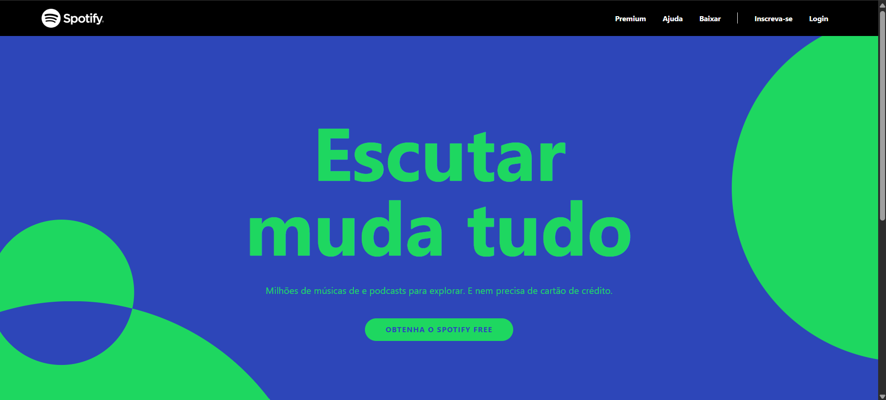
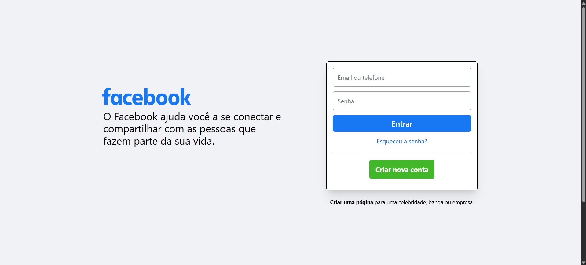
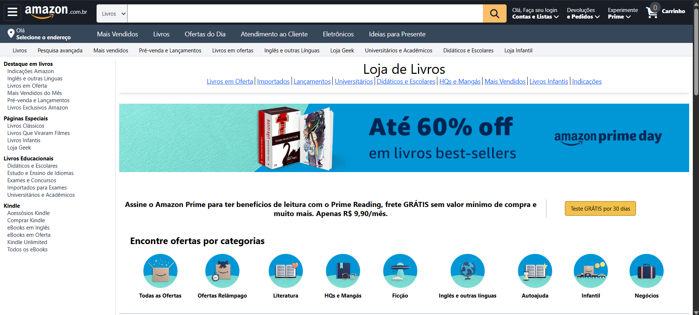

# 🌬️ Curso de Tailwind CSS — Projetos Práticos

Este repositório reúne os **projetos desenvolvidos por mim, Danielle Couto Calil, durante o curso _Tailwind CSS do básico ao avançado + Projetos_**, ministrado por Matheus Battisti na plataforma Udemy.

O curso teve duração de **11.5 horas**, com foco em aprender a criar interfaces modernas utilizando exclusivamente classes utilitárias do Tailwind CSS.  
Para reforçar o aprendizado, desenvolvi clones de páginas reais, priorizando **layout, responsividade e boas práticas de estilização**.

---

## 📁 Projetos Desenvolvidos

### 🎵 `home_spotify` — Clone da Home do Spotify

> 🎧 Página inicial do Spotify com foco em design escuro e componentes interativos.

**O que foi trabalhado:**
- Layout com **Grid** e **Flexbox**
- Uso de **cores personalizadas** e **gradientes**
- Estilização de cards de álbuns e playlists
- Responsividade com breakpoints (`sm`, `md`, `lg`)

## 📸 Prévia do Projeto

---

### 🔐 `login_facebook` — Página de Login do Facebook

> 🔵 Interface clássica da tela de login do Facebook.

**O que foi trabalhado:**
- Formulários com **inputs estilizados**
- Botões com **efeitos de hover**
- Layout centralizado e responsivo
- Simplicidade visual e clareza tipográfica

## 📸 Prévia do Projeto

---

### 📚 `livros_amazon` — Página de Livros da Amazon

> 📖 Página de listagem de livros semelhante à antiga interface da Amazon.

**O que foi trabalhado:**
- Criação de **cards de produtos** com imagens, descrições e preços
- Seções horizontais estilo **carrossel estático**
- Organização visual em **grid responsivo**
- Componentização visual com reutilização de estilos

## 📸 Prévia do Projeto

---

## 🧠 Conhecimentos Aplicados

- Estilização com **Tailwind CSS** via CDN
- Criação de **componentes visuais reutilizáveis**
- Layouts com **Flexbox e Grid**
- Manipulação de **espaçamentos, fontes, cores, bordas e sombras**
- Uso eficiente de breakpoints e classes responsivas